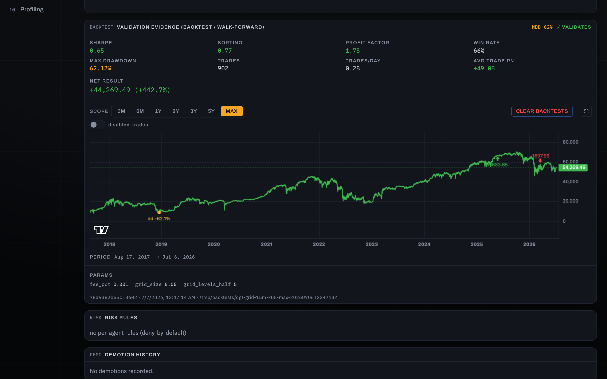

# TANK: an automated trading system

**A private algorithmic trading platform I designed and built end-to-end: live market data in, risk-checked orders out, and an operator dashboard over all of it.** It runs 24/7 in paper mode against the Binance Futures API on the exchange testnet. The connectivity is real, the capital is simulated. Going live with real money is a deliberate, gated milestone, not a config flag.

*The operator deck, live: a ticker tape streamed from the exchange, account capital, an open position held by a strategy agent, and the agent fleet. Hovering the tape pauses it, and the top-bar API meter opens the exchange-budget breakdown. Every number on screen carries its freshness, so stale data announces itself.*

## What works today

- **Full pipeline, event-driven**: WebSocket/REST market data → strategy agents → **an independent, non-bypassable risk engine** → order routing → fills, positions, PnL, reconciliation. Ten typed-Python services that talk only through Kafka-API messaging (Redpanda).
- **Hard safety rails**: a max-drawdown breach pauses an agent into reduce-only mode, and a daily-loss breach blocks new entries until the day rolls over. There are global and per-agent kill switches, and every order passes pre-trade checks. The risk engine fails loud, never open.
- **In-house backtesting engine**, no framework: event-driven and decimal-exact, with commissions, slippage, funding, partial fills, liquidation modeling and **walk-forward validation**. It runs the *exact same strategy code* as live trading, on production exchange history.
- **One-click validation from the dashboard**: any agent can regenerate its multi-period and walk-forward backtest suite, and the verdict decides whether it may be enabled.
- **Strategies only from published sources** (two of them implement arXiv papers). A hard project rule forbids invented algorithms, and a suspiciously smooth backtest triggers a mandatory stop-and-review.
- **Self-healing operations**: exchange-vs-system reconciliation with an audit trail, service heartbeats with build-drift detection, an upfront model of the exchange rate limits, and backup restore drills.

*The strategy fleet and a live agent's detail view: price chart with executed / rejected / signal markers, the live equity curve, and per-agent lifecycle (test → production), allocation and risk ruleset.*

*Validation evidence for a grid-trading agent (an arXiv-paper implementation): Sharpe, profit factor, drawdown, 900+ simulated trades and a nine-year equity curve. Honest metrics, including the ugly ones.*

## Under the hood

Python 3.12 (`mypy --strict`) · Redpanda (Kafka API) · TimescaleDB · PostgreSQL · Redis · FastAPI · Next.js + TypeScript · Docker Compose · Grafana

Around **1,500 automated tests** (unit, integration, E2E), a full local CI pipeline with lint, strict typing, dependency audits and integration suites on disposable databases, secret scanning on every commit, and roughly 1,000 commits across 150+ reviewed pull requests in the first seven weeks *(as of July 2026)*.

## About the source

The codebase is private (it is, after all, a trading system). I'm happy to walk through the architecture and the code in a conversation.

---

*Designed, built and operated by [Damian Michałowski](https://github.com/damianmichalowski).*
